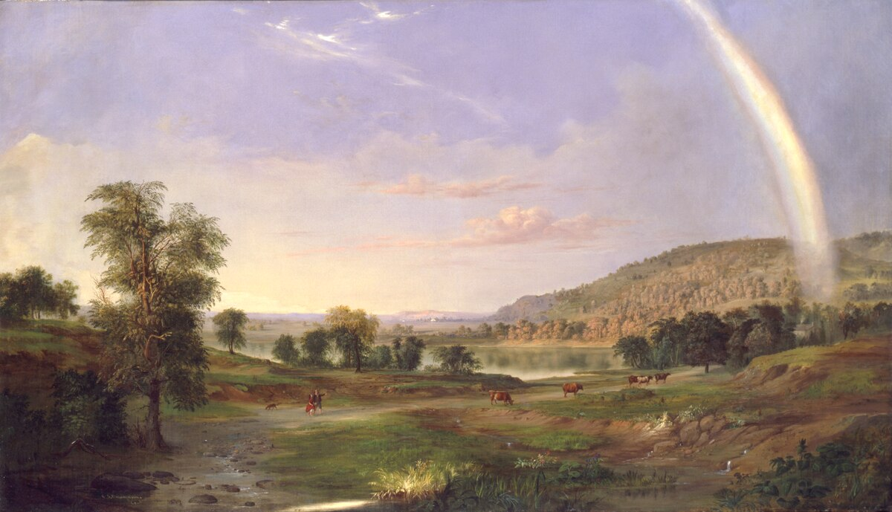

# Lecture2 NeoClassicism
Neoclassicism was an 18th- and early 19th-century cultural movement that emerged as a reaction to the ornate excesses of Baroque and Rococo styles. Rooted in the Enlightenment's emphasis on reason, order, and moral virtue, it drew inspiration from the art, architecture, and ideals of ancient Greece and Rome. Here's a structured overview:
## The Idea of the Classical, and its transformation in American Landscape Painting

Robert Duncanson, American, Landscape with Rainbow, 1859
#### 1. What do you see (first impressions), from the overall image to small details?
##### First Impressions
- Tranquil grandeur: A serene, luminous landscape bathed in golden light, with a sweeping rainbow bridging stormy clouds and sunlit fields.
- Harmony vs. tension: Contrast between the darkened, brooding sky (left) and the radiant, fertile valley (right) creates a dynamic balance.
- Human-nature symbiosis: Small figures and a cabin nestle into the land, suggesting peaceful coexistence with the untamed wilderness.
#### 2. What are the “representational” elements–trees, figures, buildings, sky, ground, etc.–as well as the “abstract” elements–color, tone, light, line, shape, texture, etc?
##### Representational Elements
- Landscape:
    - Foreground: Rolling hills, a meandering stream, lush greenery, and a lone tree leaning toward the light.
     - Middle ground: A shepherd with sheep and a farmer guiding oxen near a rustic cabin.
    - Background: Jagged mountains under a dramatic sky, with a rainbow arcing over the scene.
    - Figures: Rural laborers (likely Black or working-class settlers) tending livestock and land.
    - Architecture: A modest wooden cabin, blending into the environment.
##### Abstract Elements
- Color: Warm golds and greens dominate the sunlit valley, contrasting with cool grays and blues in the stormy sky. The rainbow’s prismatic hues soften this divide.
- Light: Divine, almost theatrical illumination highlights the valley, symbolizing hope and renewal.
- Line/Shape: Diagonal lines (rainbow, leaning tree) guide the eye from darkness to light; organic shapes evoke natural harmony.
- Texture: Soft, blended brushwork in the sky vs. detailed foliage and craggy mountains.
#### 3. How do you put those details together towards speculative, narrative observations, like:
#### 4. Where is this?
Likely an idealized American frontier, combining elements of the Hudson Valley (Hudson River School influence) and the Midwest (Duncanson’s travels). The rainbow mythologizes the land as a “promised” space.
#### 5. Continent, country, state or region; how would you describe the landscape?
#### When is this?
- Era: Pre-Civil War America (1859, on the brink of conflict).
- Season: Late spring/summer—verdant and fertile.
- Time of day: Dusk, with a lingering storm and emergent light.
#### Era, century, decade?
#### Season, time of year?
- Time of day?
- Who are the people
The figures are anonymous rural workers, possibly symbolizing Black resilience or universal agrarian labor. Their small scale emphasizes nature’s dominance.
- Age; race; gender; class; occupation?
#### What do other elements tell us?
    - 1. Is there a perspective to that representation, and if so, who is looking?
    - 2. Who does it represent?
    - 3. Whose viewpoints do we not see?
    - 4. What ideas or histories does the work represent?

Perspective & Representation
- Viewpoint: Elevated, godlike perspective invites the viewer to witness nature’s sublimity. The rainbow acts as a mediator between chaos (storm) and order (cultivated land).
- Absences: No explicit markers of slavery or strife, despite the era’s tensions. Duncanson may idealize unity or cloak dissent in beauty.
- Artist’s Voice: As a Black artist navigating racism, Duncanson’s serene vision could subtly assert belonging and hope. The rainbow—a symbol of covenant—may allude to emancipation or spiritual solace.

Historical & Ideational Context
- Manifest Destiny: The pristine landscape reflects 19th-century expansionist ideals, yet the focus on laborers critiques Romanticism’s elitism by centering humble, Black-inclusive narratives.
- Hudson River School Influence: Echoes Cole’s sublime vistas but infuses them with subtle social commentary.
- Abolitionist Undertones: The rainbow’s promise of renewal may parallel abolitionist hopes, positioning nature as a moral force opposing human oppression.
#### Does what you see tell you anything about the artist?
Duncanson’s painting bridges Romantic idealism and coded resistance. By depicting Black figures harmoniously inhabiting an Edenic America, he challenges exclusionary narratives of his time. The work’s beauty disarms, inviting viewers to imagine a nation united by shared labor and natural splendor—a radical vision for 1859.

