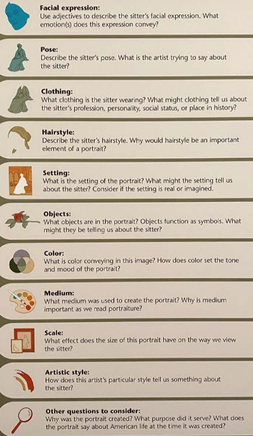

# Lecture 3 National Portrait Gallery
- How do we assess or agree on what is “good” art?
- Do we first have to agree on what is art?
- How do museums make those decisions in order to decide what to
collect?

