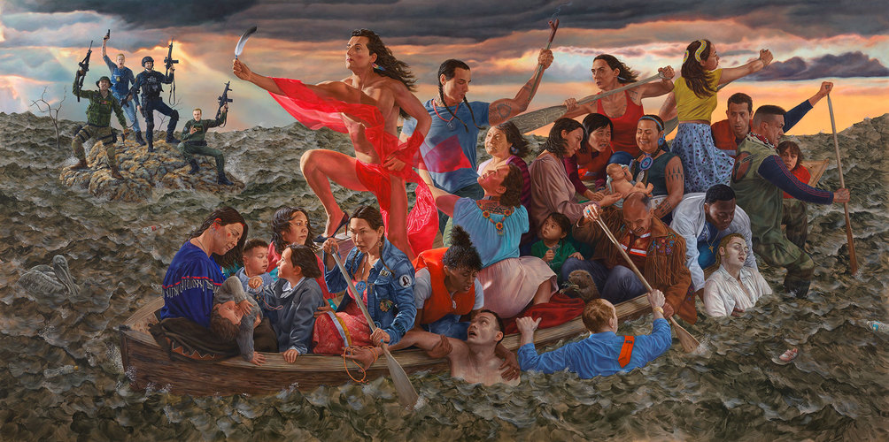
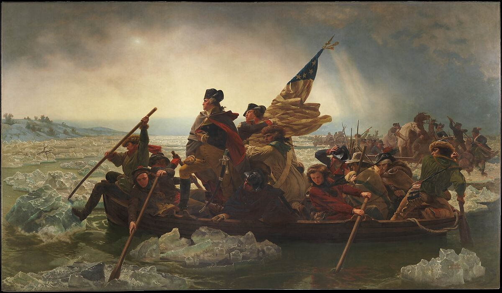

# Lecture 4 
- Keeping in mind some of the conventions of landscape and
portraiture that we have looked at, how would you apply the
questions from this list to a work by Wendy Red Star, Kent Monkman,
or James Luna?
- What other questions or perspectives do any of the Indigenous artists
we looked at bring to landscape, portraiture, and history?

Kent Monkman (Cree), Resurgence of the People, 2019, Acrylic on canvas, 132” x 264”

Emanuel Leutze, Washington Crossing the Delaware, 1851.
