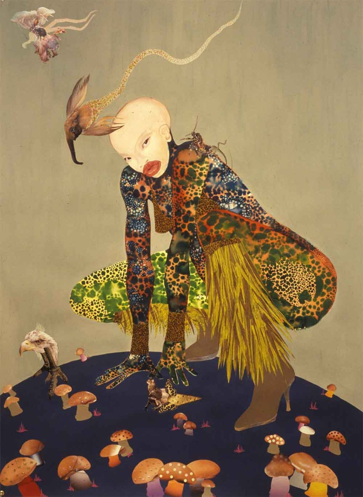

# Lecture 5 National Museum of African American History and Culture
#### There are four pillars upon which the NMAAHC stands:
- It provides an opportunity for those who are interested in African American
culture to explore and revel in this history through interactive exhibitions
- It helps all Americans see how their stories, their histories, and their cultures are
shaped and informed by global influences
- It explores what it means to be an American and share how American values like
resiliency, optimism, and spirituality are reflected in African American history and
culture
- It serves as a place of collaboration that reaches beyond Washington, D.C. to
engage new audiences and to work with the myriad of museums and educational
institutions that have explored and preserved this important history well before
this museum was created.

This Museum will tell the American story through the lens of African American
history and culture. This is America’s Story and this museum is for all
Americans. Lonnie G. Bunch, III, Founding Director, NMAAHC

[Afrofuturism](https://en.wikipedia.org/wiki/Afrofuturism) is a cultural aesthetic, and philosophy of science and history that explores the intersection of the African
diaspora culture with science and technology. It addresses
themes and concerns of the African diaspora through technoculture and speculative fiction,
encompassing a range of media and artists with a shared
interest in envisioning black futures that stem from Afrodiasporic experiences.

- How has the museum responded to the histories of slavery,
segregation, and Civil Rights and Black Lives Matter protests?
- #### What are some of the Afrofuturist ideas, styles, and methods invented and used by artists?

Wangechi Mutu,Riding Death in My Sleep, 2002,ink collage on paper, 60 x 44 inches

Wangechi Mutu's Riding Death in My Sleep (2002) employs Afrofuturist themes, styles, and methods through a lens of hybridity, reclamation, and transformative futures. Here’s a breakdown of its Afrofuturist elements:

#### Afrofuturist Ideas
##### Hybridity and Post-Humanism:
Mutu’s signature hybrid figures—merging human, animal, mechanical, and organic forms—challenge fixed identities, embodying Afrofuturism’s rejection of colonial and gendered categorizations. These cyborg-like beings suggest new, liberated modes of existence beyond Western binaries.

##### Confronting Historical Trauma:
The title’s allusion to “riding death” evokes a reckoning with legacies of violence (slavery, colonialism) while transforming death into a vehicle for agency. This aligns with Afrofuturism’s focus on reimagining the past to empower marginalized futures.

##### Spiritual Cosmologies:
The dreamlike, liminal space of the artwork invokes ancestral or spiritual realms, reflecting non-Western cosmologies. Afrofuturism often bridges technology and tradition, suggesting ancestral wisdom as a tool for futuristic resilience.

##### Reclamation and Resistance:
By repurposing colonial or consumerist materials (e.g., medical diagrams, fashion magazines), Mutu critiques objectification of Black bodies and reclaims narratives, turning fragmentation into empowerment.

#### Stylistic Approaches
##### Collage as Fragmentation and Reassembly:
Layered ink collage techniques fracture and recombine imagery, symbolizing the reconstruction of diasporic identity. This method disrupts linear histories, creating speculative, nonlinear futures.

##### Surreal Aesthetics:
Mutu’s surreal, otherworldly landscapes and figures evoke alternate realities, a hallmark of Afrofuturist worldbuilding. The large scale (60x44”) immerses viewers in this speculative space, demanding engagement.

##### Organic-Mechanical Juxtaposition:
Blending biological forms with mechanical elements critiques the dehumanizing effects of technology while imagining its potential for liberation—a tension central to Afrofuturism.

#### Methods and Symbolism
##### Material Reappropriation:
Using found materials, Mutu subverts their original contexts (e.g., medical imagery’s colonial history) to critique systems of power and envision decolonial futures.

##### Symbolic Motifs:
Serpentine or fluid forms may reference transformation (e.g., shedding skin) or danger, symbolizing resilience in navigating oppressive structures.

##### Liminal Spaces:
The dream state implied by the title positions the work in a threshold between life/death, past/future—a site of Afrofuturist possibility where new identities and societies emerge.

#### Conclusion
Mutu’s work epitomizes Afrofuturism’s ethos: using fragmentation, hybridity, and speculative aesthetics to confront historical violence while imagining liberated, pluralistic futures. By centering Black femininity and diasporic spirituality, Riding Death in My Sleep transforms trauma into a dynamic force of renewal, embodying Afrofuturism’s radical hope.

